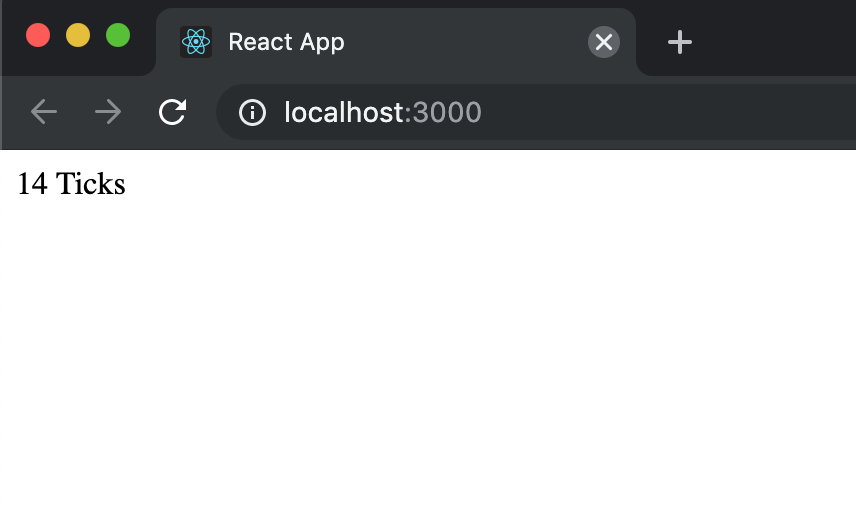

# React Basics Workshop

In this workshop we will cover the basics of **React**, especially for component reuse patterns known as *render props* and *HOC*.

### Start up

After cloned this repo, run `yarn install` and then `yarn start` to make sure your local environment are ready.

### The working code

There are working branches for each phase, run `git branch -r` for an overview, feel free to checkout any of them to play around.

### Phase 1: Ticker

Implement a `Ticker` component which will instantly update how many seconds passed since the component did mount to the DOM.

### Phase 2: DelayedButton

Implement a `DelayedButton` component which only allow user to click after 5 seconds when it mount to the DOM.

### Phase 3: `render props` - Timer

At this point you might find that some logic duplicated in the `Ticker` and `DelayedButton`, like initiate the timer, update the components' state. Now let's try to use **render props** pattern to reuse the stateful logic, let's just call it `Timer`.

### Phase 4: `HOC` - withTimer

Now let's refactor a bit to evolve our `render props` into `HOC`. With which we can get rid of the `render props` hell and embrace the composition.
